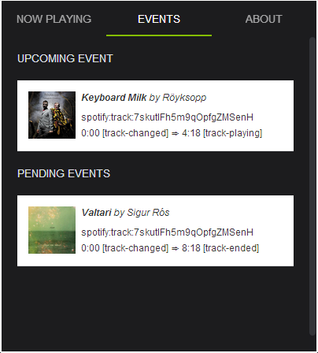

**[Hipstogram][1]** is a project to analyze the habits of people when they are listening to music. Thus, we are able to answer questions such as: Why do people like this song? Which parts of this song do people like the most? What sort of people like this artist? All these questions will help us to understand people and their behaviors.

As an ambitious but realistic goal, it is composed of different subprojects: a Google Chrome extension, a backend, a Storm topology and a frontend.  At this moment, **Hipstogram** is still in its early stages. Use it under your own risk and feel free to send us as many feedback as you want.

----------

Google Chrome Extension
--------------------------------

This repository contains the source code for the Google Chrome Extension. It has been developed using [Polymer][2] and it must be processed with vulcanize to use it in a Google Chrome Extension (see Note).

To install vulcanize:

    npm install -g vulcanize

To generate a version without Inline Javascript:

    vulcanize -o dist/build.html hipstogram.html --csp

> **Note:**
> Content Security Policy (CSP) is a JavaScript security model that aims to prevent XSS and other attacks. In so doing, it prohibits the use of inline scripts. To use Polymer in a CSP environment that doesn’t support inline scripts, pass the --csp flag to Vulcanize.

----------

Screenshots
--------------------------------

----------

License
--------------------------------

This work is licensed under a Apache v2.0 License.

Copyright (c) 2014 by Andrés Sánchez Pascual

  [1]: http://hipstogram.io/
  [2]: http://www.polymer-project.org/